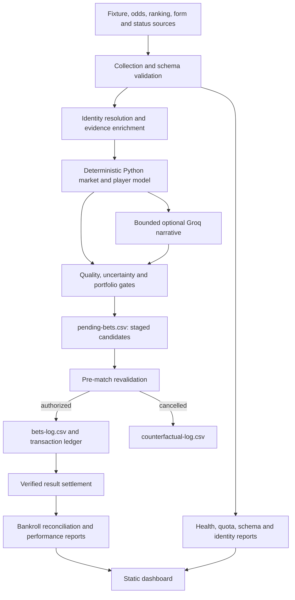

# Tennis Betting Bot Architecture

This document is the authoritative description of the implemented tennis-bot architecture. `PROJECT-ROADMAP.md` tracks delivery status, `how i bet.txt` defines the betting policy, and this document defines component boundaries, data flow, state ownership, and safety invariants. When code and this document disagree, treat the code as the current behavior and update this document in the same corrective change.

## System objective

The system collects independently verifiable tennis fixtures, prices, player evidence, and results; computes deterministic pre-match probabilities and risk controls; stages eligible candidates; revalidates them shortly before play; records authorized bets; and settles them without inventing missing facts.

The bot is not an autonomous bookmaker client. It produces and maintains a decision ledger. It does not place wagers through a bookmaker API.

## Architectural principles

- Deterministic Python calculations are authoritative for probability, EV, eligibility, staking, bankroll, and settlement.
- Groq output may summarize evidence and propose candidates, but it cannot override verified calculations or directly create a bet.
- Discovery and authorization are separate phases. A staged candidate is not a bet and does not deduct bankroll.
- Provider failure, schema failure, an empty schedule, and missing odds are separate terminal states.
- Missing or malformed safety configuration fails closed for live authorization.
- Historical outcomes cannot enter decision-time features. Learning uses chronological training and holdout windows.
- Every financially relevant mutation is duplicate-safe, atomically written, and reconcilable.
- Learned policies remain shadow-only until their configured maturity and holdout gates pass.
- Secrets enter only through process environment variables supplied by GitHub Secrets or the local operator.

## System context and data flow

No path from Groq reaches `bets-log.csv`, `bankroll.txt`, or `bankroll-transactions.csv` without passing through deterministic validation, portfolio selection, manual/automatic stop controls, and pre-match revalidation.

## Runtime entry point and modes

The executable is `tennis-bot/tennis_bot.py`. Its modes share the same state and safety functions:

| Mode | Invocation | Network | AI | Financial state | Purpose |
|---|---|---:|---:|---:|---|
| Daily | default | Yes | Optional | Stages only | Collect, model, validate and stage candidates |
| Paper daily | `--paper-trading` | Yes | Optional | Paper ledger only | Exercise the full lifecycle without real bankroll changes |
| Revalidation | `--revalidate-only` | Yes | No | May authorize and deduct | Refresh near-start prices/status and authorize or cancel staged candidates |
| Settlement | `--settle-only` | Yes | No | May credit/reconcile | Resolve authorized bets from primary results or exact two-source fallback consensus |
| Backtest | `--backtest-only` | No | No | None | Rebuild performance and policy reports from recorded ledgers |
| Diagnostic | `--diagnostic` | Yes | No | None | Test collection/model coverage with no writes, stakes, AI, or settlement |

Every mutating run records its phase in `run-state.json`. An interrupted run is detected on the next invocation and handled through the recovery path. `--force` bypasses the same-day generation guard but does not bypass duplicate bet keys or safety gates.

## Component boundaries

### Collection and provider controls

Collection normalizes fixture and price payloads, validates required fields, filters singles markets, and records fixture-source agreement. The HTTP layer owns timeouts, bounded retries, authentication/quota key rotation, provider circuit breakers, response caching, safe quota metadata, and schema-change alerts.

Collection may return one of several explicit fixture states, including provider failure, provider schema failure, valid empty schedule, and odds unavailable. Downstream analysis must not reinterpret a provider failure as an empty betting day.

### Identity and evidence enrichment

Names are normalized before joins. Exact aliases live in `player-aliases.csv`; only unique high-confidence matches can be saved automatically. Ambiguous identities enter `player-alias-review.csv` and `unresolved-player-identities.md`. Unresolved or weak identities reduce data quality and cannot silently inherit another player's profile.

Evidence enrichment attaches rankings, Elo, surface Elo, recent and surface form, opponent-adjusted results, serve/return data, clutch and best-of-five features, workload, verified status, surface transitions, and sourced travel context when available. Missing evidence remains missing; it is never filled from AI narrative.

### Deterministic model

The model preserves market, Elo, form, and serve/return components separately. It de-vigs two-way moneylines, rejects implausible or isolated prices, applies bounded context/workload penalties, calculates uncertainty-adjusted EV, and records all components in `predictions-log.csv`.

The immutable `MODEL_VERSION` identifies the formula/policy implementation used for each prediction. Format, environment, calibration, workload, and market-limit challengers train chronologically and activate only after their explicit sample and holdout gates.

### AI boundary

Groq receives a bounded subset of already verified match evidence. API keys rotate only after authentication or quota failures. If all Groq calls fail, the run produces a deterministic Python report and continues.

AI estimates are not accepted as model probabilities. Parsed narrative candidates are rematched to verified fixtures and recalculated by Python. Saved reports append a `PYTHON VALIDATION RESULT`; if Python accepts nothing, the authoritative decision is `NO BETS` regardless of earlier prose.

### Decision and portfolio policy

Validation checks odds bounds, evidence quality, model reliability, EV after uncertainty, physical status, market quality, duplicate identity, and safety-stop state. Portfolio selection then applies tournament correlation, opposite-selection, bet-count, daily exposure, and tour exposure caps.

Accepted daily candidates are written to `pending-bets.csv`, not the live bet log. Newly staged near-term candidates receive an immediate pre-match check, while the scheduled workflow begins rechecking waiting candidates inside a 180-minute window. Revalidation checks start/status, opponent, surface, bookmaker count, price movement, price freshness, dispersion, and final risk-adjusted EV. A match more than five minutes past its scheduled start remains ineligible. Only an authorized revalidation can write a live bet and debit bankroll.

Every active and shadow policy decision is recorded in `counterfactual-log.csv`. Shadow decisions never place bets or change bankroll.

### Bankroll and settlement

`bankroll-transactions.csv` is the immutable hash-linked financial ledger. `bankroll.txt` is the reconciled current balance projection. Authorization creates one stake debit per unique bet; settlement creates the corresponding return/refund credit. Duplicate keys prevent repeat deductions and credits.

Settlement matches verified events using event/date/player identity. Wins, losses, voids, retirements, and walkovers follow explicit result and bookmaker-policy rules. Unverified outcomes remain open and generate overdue alerts rather than being inferred.

### Reporting, monitoring, and dashboard

Reports are derived views, not decision inputs. They cover dated picks, performance, backtests, policy health, settlement problems, operational anomalies, source latency/freshness, quota consumption, schema changes, and unresolved identities.

`docs/index.html` is a read-only static dashboard that fetches committed ledgers and health JSON from the repository. It escapes external values before inserting them, labels small samples, displays the current model/policy and stop state, and never mutates bot state.

Optional Telegram and SMTP delivery runs after core state is saved. Delivery failure is non-fatal, and persisted delivery status excludes credentials and provider response bodies.

## State ownership

| State | Authoritative writer | Meaning |
|---|---|---|
| `pending-bets.csv` | Daily generation and revalidation | Candidate lifecycle: staged, authorized, or cancelled |
| `bets-log.csv` | Revalidation and settlement | Live authorized bets and verified outcomes |
| `paper-bets-log.csv` | Paper authorization and settlement | Simulated bets isolated from real bankroll |
| `predictions-log.csv` | Daily model and settlement | Immutable decision-time features plus later result/CLV fields |
| `counterfactual-log.csv` | Policy evaluation and settlement | Active/shadow decisions and hypothetical outcomes |
| `bankroll-transactions.csv` | Authorization and settlement | Hash-linked debit/credit ledger |
| `bankroll.txt` | Reconciliation | Current real balance derived from financial lifecycle |
| `price-history.csv` | Collection/revalidation/settlement | Timestamped market snapshots |
| `prediction-snapshots/` | Daily model | Reproducibility evidence referenced by hash from audit rows |
| `run-state.json` | Runtime coordinator | Current/last phase and interrupted-run recovery state |
| `model-policy-state.json` | Model rollback controller | Champion/challenger health and safe-policy rollback state |
| `kill-switch.json` | Human operator | Repository-level manual authorization stop |
| `risk-config.json` | Human operator | Exposure caps and bookmaker retirement rules |
| `external-cache.json` | HTTP layer | Bounded fresh/stale provider-response cache |
| `player-aliases.csv` | Reviewed/qualified identity process | Provider name to canonical player mappings |

All CSV/text/JSON state replacements use temporary files followed by atomic replacement. Schema migration creates a timestamped backup under `state-backups/` before rewriting historical rows.

## Safety invariants

The following are architecture requirements, not optional behavior:

1. A daily run cannot deduct real bankroll.
2. A staged candidate cannot appear in the live bet log until pre-match authorization succeeds.
3. A duplicate rerun cannot debit or credit the same bet twice.
4. AI text cannot set the authoritative probability, stake, result, or bankroll.
5. Missing verified results cannot be converted into a win or loss.
6. Paper mode cannot mutate the real bet log, real transaction ledger, or real bankroll.
7. Diagnostic and backtest modes cannot place, authorize, or settle live bets.
8. Manual stop, automatic mature-sample stop, and malformed stop configuration prevent live authorization.
9. Provider/schema failure cannot be reported as a valid empty schedule.
10. Learned weights or thresholds cannot activate before chronological holdout and maturity gates pass.
11. Notifications cannot run before required state is saved and cannot make a successful bot run fail.
12. Secrets cannot be written to tracked state, operational summaries, notification status, or dashboard data.

## GitHub automation

| Workflow | Schedule/trigger | Responsibility |
|---|---|---|
| `daily-tennis.yml` | Daily 06:00, 12:00 and 18:00 UTC/manual | Incremental tests, collection, modelling, staging, reporting and state commit |
| `revalidate-tennis.yml` | Every 30 minutes/manual | Tests and near-start authorization/cancellation |
| `settle-tennis.yml` | 02:30, 14:30 and 22:30 UTC/manual | Tests, verified settlement and reconciliation |
| `tennis-quality.yml` | Relevant pushes/PRs/manual | Unit/integration tests and required coverage |

Recurring workflows reuse a dependency cache keyed by `requirements-test.txt`. Result-only settlement downloads independent providers and dated scoreboards concurrently; provider trust, identity matching, and conflict rules are applied only after all evidence is normalized.
| `secret-scan.yml` | Push/PR/weekly/manual | Full-history secret detection |
| `dependency-audit.yml` | Dependency changes/weekly/manual | Strict known-vulnerability audit |

The three state-mutating workflows share one concurrency group and do not cancel active runs. Tests execute before bot mutation. Workflows commit generated state back to the repository. External actions are pinned to immutable commit SHAs.

## Security and trust boundaries

- Production credentials are read from environment variables and GitHub Secrets; credential values are never logged.
- Odds and Groq keys are positional pools. Rotation changes the active credential only for authentication/quota failures, not arbitrary transient failures.
- Provider data, AI text, CSV contents, and dashboard data are untrusted inputs and must be validated or escaped at their boundary.
- Manual configuration files are validated and fail closed where they affect live betting.
- Secret scanning covers Git history. Dependency scanning reports known vulnerabilities but does not automatically upgrade packages.

## Change protocol

Any change to probabilities, uncertainty, validation thresholds, staking, portfolio limits, settlement, financial state, model promotion, or provider schema must include:

1. A new immutable model/policy version when historical interpretation changes.
2. Tests for success, rejection, malformed input, duplicate execution, and recovery where applicable.
3. Chronological out-of-sample evidence before enabling learned behavior.
4. Backward-compatible schema migration with a pre-migration backup for persistent ledgers.
5. Updates to this architecture document, the roadmap, policy documentation, and dashboard fields when their contracts change.
6. A passing coverage gate, workflow validation, secret scan, and dependency audit.

Production promotion remains a human decision. Counterfactual, calibration, CLV, and paper-trading evidence inform that decision; no report automatically expands risk or enables a new policy.
